# Peptic Ulcer Disease: visual board

YMnotes Digestive System · tap any image to open it full size. Photo titles link to their source page.

## p. 43

<table>
<tr><td width="50%" valign="top"><b>Ulcer vs Erosion</b>  <a href="p43-ulcer-vs-erosion.svg">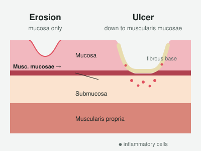</a> Illustration</td><td width="50%" valign="top"><a href="https://commons.wikimedia.org/wiki/File:Benign_gastric_ulcer_3.jpg"><b>Ulcer Crater in Cross-Section</b></a>  <a href="p43-ulcer-section.jpg">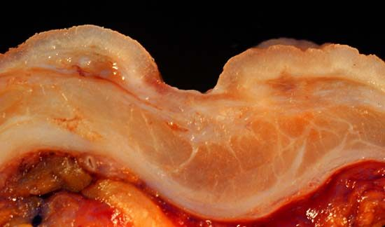</a> Ed Uthman, MD · Public domain</td></tr>
<tr><td width="50%" valign="top"><a href="https://commons.wikimedia.org/wiki/File:Gastric_erosion.jpg"><b>Gastric Erosions</b></a>  <a href="p43-erosions.jpg">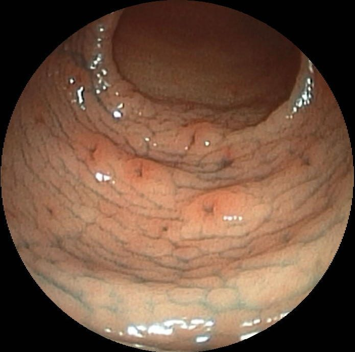</a> Med_Chaos · Public domain</td><td width="50%" valign="top"><b>Where DUs and GUs Sit</b>  <a href="p43-where-dus-and-gus-sit.svg">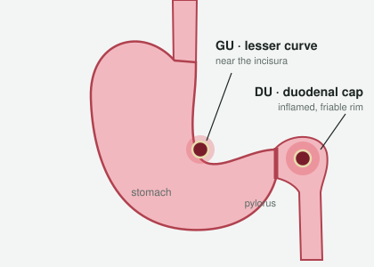</a> Illustration</td></tr>
<tr><td width="50%" valign="top"><a href="https://commons.wikimedia.org/wiki/File:Duodenal_ulcer,_Forrest_III,_healing_phase.jpg"><b>Duodenal Ulcer on Endoscopy</b></a>  <a href="p43-duodenal-ulcer.jpg">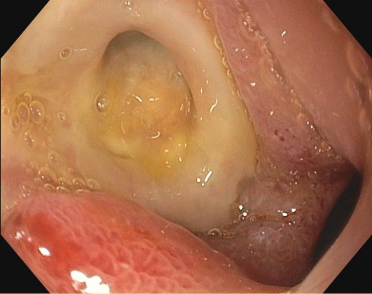</a> Jmarchn · CC BY-SA 3.0</td><td width="50%" valign="top"><a href="https://commons.wikimedia.org/wiki/File:Deep_gastric_ulcer.png"><b>Gastric Ulcer on Endoscopy</b></a>  <a href="p43-gastric-ulcer.jpg">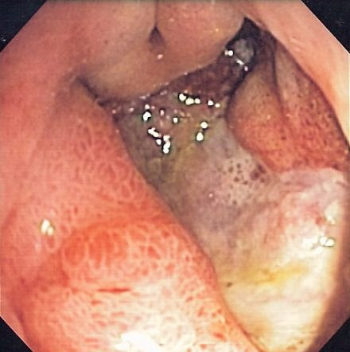</a> Samir · CC BY-SA 3.0</td></tr>
<tr><td width="50%" valign="top"><b>One-Finger Pointing Sign</b>  <a href="p43-one-finger-pointing-sign.svg">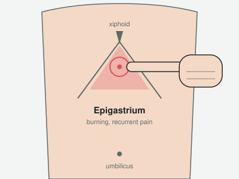</a> Illustration</td><td width="50%" valign="top"><b>DU vs GU Pain Clues</b>  <a href="p43-du-vs-gu-pain-clues.svg">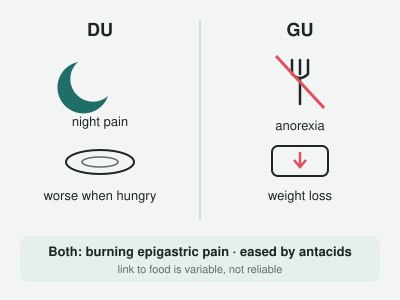</a> Illustration</td></tr>
<tr><td width="50%" valign="top"><b>Posterior Ulcer → Back Pain</b>  <a href="p43-posterior-ulcer-back-pain.svg">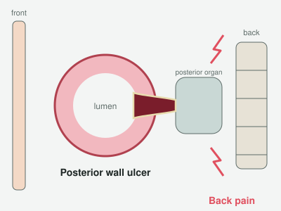</a> Illustration</td><td width="50%" valign="top"><b>Treat or Scope?</b>  <a href="p43-treat-or-scope.svg">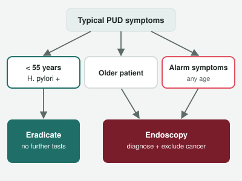</a> Illustration</td></tr>
<tr><td width="50%" valign="top"><b>Biopsy Every Gastric Ulcer</b>  <a href="p43-biopsy-every-gastric-ulcer.svg">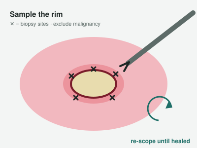</a> Illustration</td><td></td></tr>
</table>

Image sources and licenses: [CREDITS.md](CREDITS.md)
